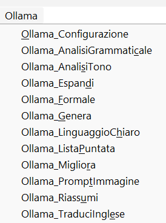

# AI OpenOFFICE First Brick

Questo progetto contiene macro Python per integrare **Ollama** (AI locale) all'interno di **OpenOffice** (Apache OpenOffice) e LibreOffice.

## File
*   `ollama_bridge.py`: Script principale contenente le macro e la logica di connessione.

## Installazione (OpenOffice / LibreOffice su Windows)
1.  Assicurati di avere [Ollama](https://ollama.com) installato e funzionante (`ollama run llama3` o altro modello).
2.  Copia il file `ollama_bridge.py` nella cartella degli script utente:
    *   **Percorso**: `%APPDATA%\OpenOffice\4\user\Scripts\python\`
    *   (Se la cartella `python` non esiste, creala).
3.  Riavvia OpenOffice.
4.  Vai su `Strumenti` > `Macro` > `Esegui macro` > `Macro personali` > `ollama_bridge`.
5.  Troverai le funzioni:
    *   `Ollama_Migliora`
    *   `Ollama_Riassumi`
    *   `Ollama_AnalisiTono`
    *   ...e altre.

## Versione per macOS (Universale)
Per istruzioni dettagliate, leggi il file [MANUALE_MACOS.md](MANUALE_MACOS.md).

La cartella include 4 script:
*   `mac_ollama_improve.sh`: Migliora il testo.
*   `mac_ollama_summarize.sh`: Riassumi.
*   `mac_ollama_expand.sh`: Estendi/Espandi.
*   `mac_ollama_generate.sh`: Genera testo da uno spunto.

Crea diverse **Azioni Rapide** in Automator (una per ogni funzione che vuoi) e incolla il codice corrispondente.
Potrai usarle tutte facendo Tasto Destro > Servizi.

## Funzioni Disponibili (OpenOffice/LibreOffice)
*   **Migliora Testo**: Rende più fluida la scrittura.
*   **Riassumi**: Sintetizza il testo selezionato.
*   **Analisi Tono**: Ti dice se il testo suona aggressivo, formale, etc. (Visualizza in finestra).
*   **Traduci**: Traduce in Inglese.
*   **Lista Puntata**: Trasforma paragrafi in elenchi puntati.

## Requisiti Tecnici
*   Lo script usa `urllib2` per compatibilità con il Python 2.7 spesso incluso nelle vecchie versioni di OpenOffice.
*   Non richiede librerie esterne complesse (`requests`, etc.) per facilitare l'uso "portatile".
